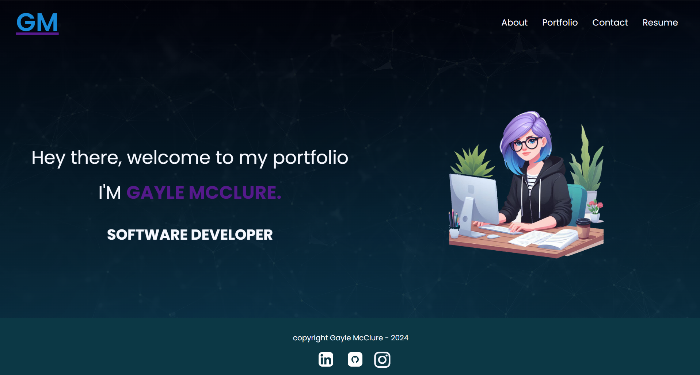
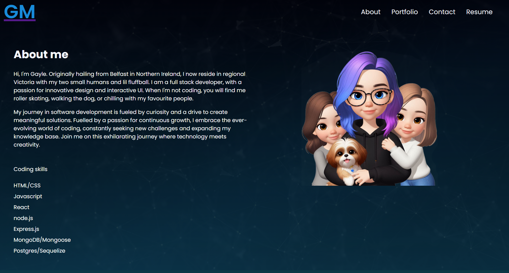
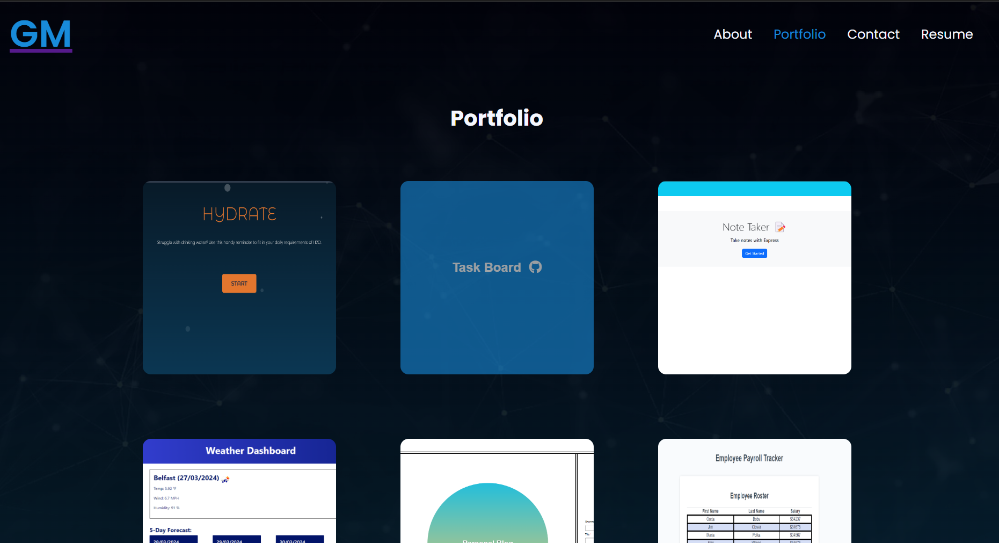
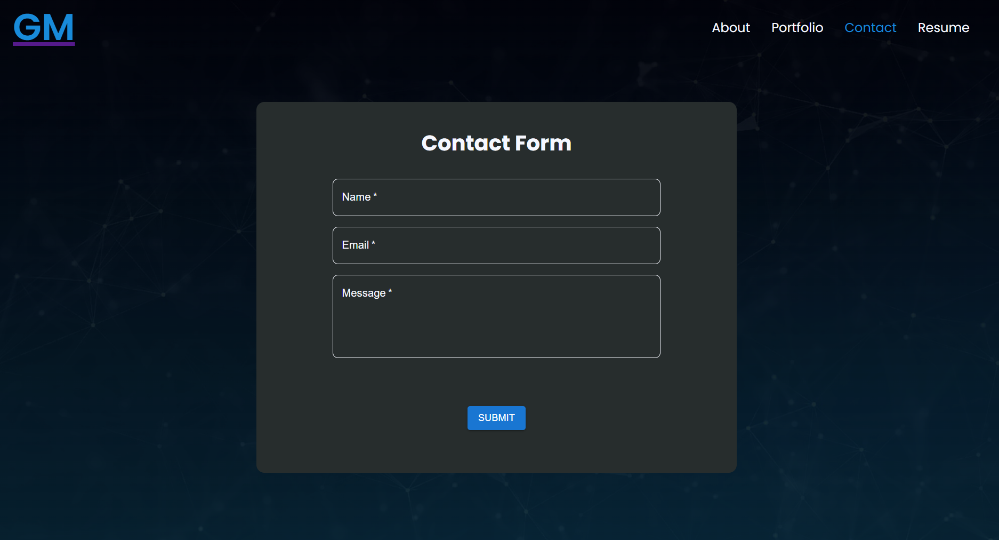
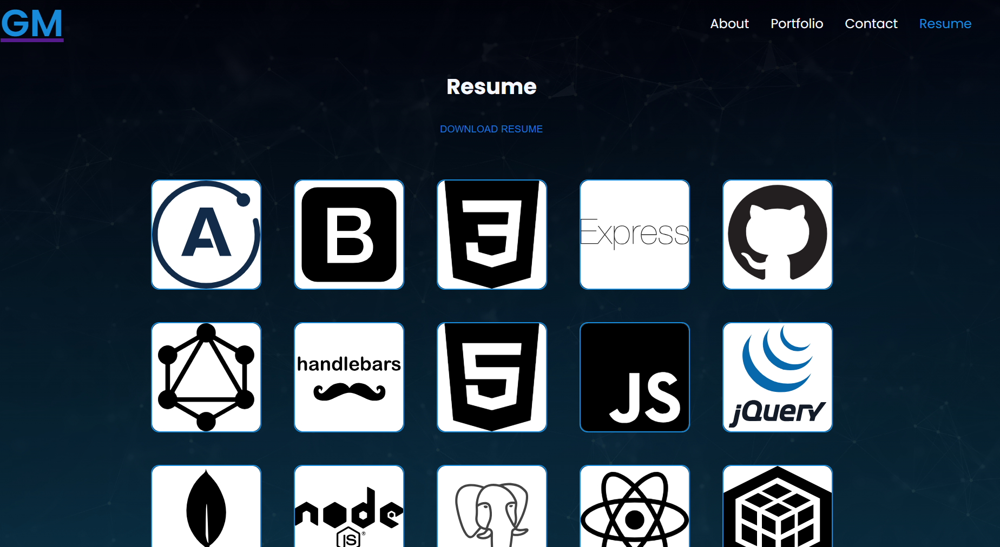

# React Portfolio

  [](https://opensource.org/licenses/MIT)
  
  ## DESCRIPTION
This is a portfolio website made to display all my current projects. It is build with node & React js, and has a list of completed projects with links to their examples. 
[Click here](https://symphonious-pixie-006884.netlify.app/) to visit my website: 

Screenshots








  ## TABLE OF CONTENTS
  
  <ol>
  <li><a href="#description">Description</a></li>
  <li><a href="#installation">Installation</a></li>
  <li><a href="#usage">Usage</a></li>
  <li><a href="#licence">Licence</a> </li>
  <li><a href="#contributions">Contributions</a></li>
  <li><a href="#questions">Questions</a></li>
  </ol>
  
  ## INSTALLATION
To clone from Github, use GitBash   
```git@github.com:gaylemcclure/react-portfolio.git```
  
  ## USAGE
  Upon installation of the project, start the app using the terminal with the following commands:   
  ```npm i```
  ```npm run dev```

Pages:
1. Home page
2. About page
3. Portfolio page
4. Contact page
5. Resume page

The website is mobile responsive, and on mobile view, the header menu shows as a dropdown. 


 
  
  ## LICENCE
  Distributed under the MIT license. For more information, see <a href=https://opensource.org/licenses/MIT>here</a>
  
  ## CONTRIBUTIONS
  Created by Gayle McClure   
  Uses React, JS, node.js. 
  
  
  ## QUESTIONS
  Github Username: <a href='https://github.com/gaylemcclure'>Gayle McClure</a>  
  Feel free to email me at gaylekdennison@gmail.com for further questions. 
